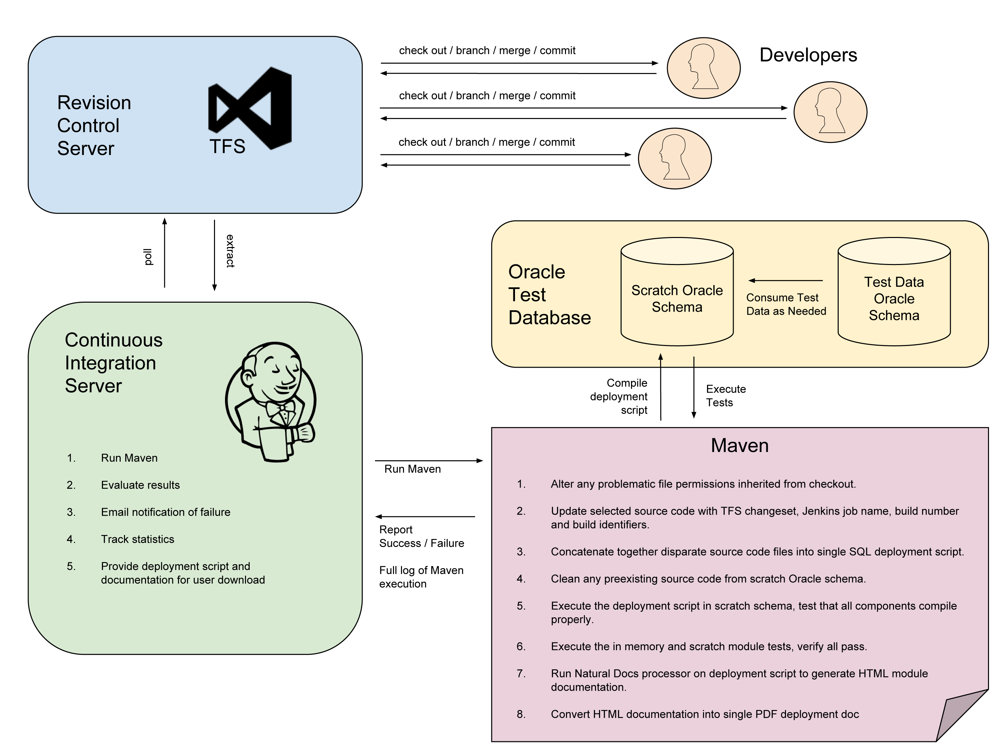

# Speculative PLSQL Continuous Integration
Setting up and maintaining a continuous integration development environment for Oracle PLSQL is a fairly problematic and involved scenario for which solutions are rather sparse.  This repository attempts to describe a fairly simplistic and no doubt limited approach to PLSQL CI.  It works for me for a specific set of "DZ" utility modules and perhaps it could serve others or provide inspiration for your own solutions.

True database CI should involve a redeployment of the database and hosted data with each build.  Doing this type of thing in Oracle can often be unwieldy - particularly before the advent of pluggable databases in 12c.  While I remain very much interested in the topic of total CI builds in Oracle, this solution just addresses CI development of a small set of independent logic, mostly sets of  generic utility code which functions to support larger application logic.

A basic system diagram would be the following

#####Revision Control System
While my environment uses MS Team Foundation Server, essentially any RCS which your CI Server can poll for changes would work.  GitHub obviously would be a good choice.

#####Continuous Integration Server
[Jenkins](https://jenkins-ci.org/) is my CI server of choice.   Jenkins provides the key abilities to poll the RCS for changes, extract those changes, launch a job, execute Maven, email build issues to owners and archive and provide statistics on build history over time.  

#####Oracle Test Database
Obviously doing PLSQL testing needs a database in which to test the code.  Your CI Server will need jdbc or OCI drivers in order to access the test database.  See addedum #1 below for more information on how to add your ojdbc drivers to Maven.  Currently I route my testing through sqlplus and thus my Jenkins server has an Oracle client installed.  Testing database logic in utter isolation often is a bit pointless.  Perhaps your code does something with an Oracle spatial index for example.  Well unless you have some data to put that index upon, creating a test would involve generating sample data or such which is a task in itself.  My test database requires a schema of test data which itself is a repository source controlled and deployed by Jenkins - see [DZ_TEST_DATA](https://github.com/pauldzy/DZ_TESTDATA).

#####Maven
Most of the heavy lifting is done with Maven 3.  The CI Server job launches Maven using a custom project object model (pom.xml) file.  See a [sample pom.xml](/pom.xml) for how my tests run.  Maven results are recorded and success/failure tracked in the Jenkins job.

#####Natural Docs
As part of the Maven build process, the pom.xml concatenates the PLSQL code into a deployment script.  This script is then run through [Natural Docs](http://www.naturaldocs.org/) to create the deployment documentation as HTML.

#####HTML2PDF
The resulting HTML doc is then converted to PDF using [wkhtmltopdf](http://wkhtmltopdf.org/).

###Code Conventions and Restrictions
* The pom.xml assembles the PLSQL code in the order necessary to compile without errors.  If your code throws errors due to circular compilation issues, well then you'd need a more robust manner to check compilation success. 
* My system assumes that each repository contains a test package having .inmemory_test and optionally .scratch_test functions.  You can set up your own tests as you like in the sqlfooter.sql static file.  

###Conclusions
The above solution may appear rather cobbled together but basically works okay for me within the limitations listed above.  It may or may not suite your coding and/or workflow.  I would appreciate it if you drop me a line with any thoughts or suggestions you have.

###Addendum
1. As Oracle ojdbc drivers are licensed by Oracle, Maven cannot just blindly download them.  However they should be part of your existing Oracle client installation.  To add to Maven, sudo as the Jenkins user and type mvn install:install-file -DgroupId=com.oracle -DartifactId=ojdbc7 -Dversion=12.1.1 -Dpackaging=jar -Dfile=$ORACLE_HOME/jdbc/lib/ojdbc7.jar -DgeneratePom=true See [this link for more information](http://stackoverflow.com/questions/1074869/find-oracle-jdbc-driver-in-maven-repository). 

